# Cell 0 OS: Sovereign Architecture & Comparative Analysis

## 1. The Ecosystem of Cell 0 OS (The "Sovereign Web")

Cell 0 OS is not just an application; it is a **Three-Tier Decentralized Operating System** designed for true AI sovereignty. We have built an ecosystem that natively runs on macOS, Linux, and Windows, completely divorced from cloud-vendor lock-in.

### 1.1 The Three-Tier Architecture

```mermaid
graph TB
    %% Core Styling
    classDef ui fill:#0f172a,stroke:#3b82f6,stroke-width:2px,color:#fff
    classDef gateway fill:#1e1b4b,stroke:#8b5cf6,stroke-width:2px,color:#fff
    classDef python fill:#052e16,stroke:#10b981,stroke-width:2px,color:#fff
    classDef rust fill:#451a03,stroke:#f59e0b,stroke-width:2px,color:#fff
    classDef external fill:#171717,stroke:#666,stroke-dasharray: 5 5,color:#ccc
    classDef memory fill:#312e81,stroke:#6366f1,stroke-width:1px,color:#fff

    %% --------------------------------------------------------
    %% LAYER 1: THE FRONTAL LOBE (User Interfaces & Channels)
    %% --------------------------------------------------------
    subgraph UI_Layer ["LAYER 1: The Frontal Lobe (Visual & Inbound)"]
        direction TB
        
        subgraph Web_UI ["Spatial Interfaces"]
            NG["🧠 Neural Glassbox (React/Vite)<br/>Live Visualization of Thoughts"]
            CP["🎛️ Nerve Portal (Node CLI)<br/>System Control Panel"]
        end

        subgraph Inbound_Channels ["The 11 Native Senses (Channel Adapters)"]
            direction LR
            WA["WhatsApp"]
            TG["Telegram"]
            DS["Discord"]
            SL["Slack"]
            SI["Signal"]
            MS["Matrix / others"]
        end
    end

    %% --------------------------------------------------------
    %% LAYER 2: THE NERVOUS SYSTEM (Node.js Gateway)
    %% --------------------------------------------------------
    subgraph Gateway_Layer ["LAYER 2: The Nervous System (Node.js Gateway :18789)"]
        direction TB
        
        WS["⚡ WebSocket Server (Real-time Sync)"]
        HTTP["🌐 Fastify HTTP & Static Server"]
        
        subgraph Routing_Engine ["Cognitive Routing"]
            SM["🔐 Session Manager<br/>(Domain Isolated Contexts)"]
            DR["🗺️ Intent Router<br/>(Classifies Input to Domain)"]
        end
        
        HTTP --> |"Serves UI"| NG
        WS <--> |"JSON-RPC Stream"| NG
        Inbound_Channels --> |"Webhooks / Polling"| HTTP
        HTTP --> SM
        WS --> SM
        SM --> DR
    end

    %% --------------------------------------------------------
    %% LAYER 3: THE BRAIN (Python Intelligence Engine)
    %% --------------------------------------------------------
    subgraph Python_Layer ["LAYER 3: The Brain (Python 3.11 Engine :18800)"]
        direction TB
        
        OB["🌉 Orchestrator Bridge (IPC)"]
        MA["👑 Meta-Agent (The Sovereign)<br/>Cross-Domain Coordinator"]
        
        subgraph COL ["Civilization of Light (COL)"]
            PE["⚖️ Philosophy Engine<br/>(Ethical Governance)"]
            TE["🪙 Token Economy<br/>(Rate Limits & Value)"]
            CS["✨ Consensus Synthesizer<br/>(Swarm Voting)"]
        end

        subgraph Agent_Library ["The 66-Agent Mesh (12 Domains)"]
            direction LR
            A_Soc["💬 Social Agents<br/>(WhatsApp Mind, etc.)"]
            A_Pro["📈 Productivity Agents<br/>(Task Oracle, etc.)"]
            A_Trav["✈️ Travel Agents<br/>(Flight Oracle, etc.)"]
            A_Fin["💰 Finance Agents<br/>(Bank Vault, etc.)"]
            A_Oth["...8 Other Domains"]
            
            A_Soc ~~~ A_Pro ~~~ A_Trav ~~~ A_Fin ~~~ A_Oth
        end

        OB <--> MA
        MA <--> COL
        MA <--> Agent_Library
    end

    %% --------------------------------------------------------
    %% LAYER 4: THE DNA (File System & Rust Kernel)
    %% --------------------------------------------------------
    subgraph Core_Layer ["LAYER 4: The DNA (Immutable Storage & Kernel)"]
        direction TB
        
        subgraph Fractured_Memory ["Fractured Vector Memory (~/.cell0/runtime/memory/)"]
            M_Soc[("social.vec")]
            M_Pro[("productivity.vec")]
            M_Trav[("travel.vec")]
            M_Fin[("finance.vec")]
        end
        
        subgraph Zero_Trust ["Sovereign Infrastructure"]
            SB["🛑 Secure Sandbox (Tool Execution)"]
            ID["🔑 Cryptographic Identity (/identity)"]
            RK["🦀 Rust Kernel Boundaries (Limits)"]
        end
    end

    %% --------------------------------------------------------
    %% SYSTEM CONNECTIONS
    %% --------------------------------------------------------
    DR ===>|"Dispatches Intent"| OB
    
    %% Mappings from Domains to Memory
    A_Soc -.->|"Isolated Read/Write"| M_Soc
    A_Pro -.->|"Isolated Read/Write"| M_Pro
    A_Trav -.->|"Isolated Read/Write"| M_Trav
    A_Fin -.->|"Isolated Read/Write"| M_Fin
    
    Agent_Library ==>|"Executes Tools"| SB
    COL -.->|"Verifies constraints"| RK

    %% Class Assigns
    class UI_Layer,Web_UI,Inbound_Channels ui;
    class Gateway_Layer,Routing_Engine gateway;
    class Python_Layer,COL,Agent_Library python;
    class Core_Layer,Zero_Trust rust;
    class Fractured_Memory memory;
    class WA,TG,DS,SL,SI,MS external;
```

### 1.2 Core Components Breakdown

1.  **The Node.js Gateway (The Nervous System):** 
    *   **Port 18789:** Handles all inbound/outbound communication via WebSockets and HTTP.
    *   **职责 (Responsibilities):** Manages 11 distinct chat channel adapters, isolates user sessions by domain (e.g., separating "Finance" chats from "Social" chats), routes intents probabilistically, and dynamically serves the React front-end.
2.  **The Python Cognitive Engine (The Brain):**
    *   **Port 18800:** The heavy-lifting intelligence layer.
    *   **职责 (Responsibilities):** Executes the 66 "Specialist" agents across 12 categories (Productivity, Travel, etc.). It manages vector memory embeddings, tool execution (Sandbox, Web Search), and runs the **Philosophical COL (Civilization of Light)** consensus loops before outputting decisions.
3.  **The Neural Glassbox UI (The Visual Cortex):**
    *   **Port 18790 (Nerve Portal):** The CLI dashboard for monitoring.
    *   **`/glassbox/`:** A dynamically injected React interface that allows the user to physically "see" the agents thinking, mapping their workflows in real-time.
4.  **The Immutable File System (The DNA):**
    *   **`~/.cell0/`:** The entire OS state lives here, totally owned by the user. It stores cryptographic identities, isolated agent workspaces, and runtime logs.

---

## 2. Comparative Analysis: Cell 0 OS vs. OpenClaw

OpenClaw is an excellent, open-source orchestration tool, but it is fundamentally a **Desktop Application / CLI wrapper** around LLM APIs. Cell 0 OS is fundamentally an **Operating System**.

### 2.1 Architectural Differences

| Feature | OpenClaw | Cell 0 OS | The Cell 0 Advantage |
| :--- | :--- | :--- | :--- |
| **Paradigm** | CLI / Menu Bar Application | 3-Tier Sovereign OS | Cell 0 runs as an omnipresent background daemon, completely abstracting the "app" layer. |
| **Agent Structure** | Linear / Sequential Tool Use | **Domain-Isolated Mesh (66 Agents)** | Cell 0 groups agents into 12 distinct ontological categories. Agents form a "Swarm" and vote on outcomes (COL). |
| **Memory** | Global Context Window | **Fractured Vector Memory** (`*.vec`) | Cell 0 isolates memory by domain. The "Finance Oracle" cannot access the "Social Mind" memory, ensuring zero context-contamination. |
| **Distribution** | `npm install -g` (Node only) | `npm install -g` (Node + Python + React) | Cell 0 orchestrates three entirely different language environments natively through a single global installation command. |
| **User Interface** | Terminal Text / Simple Electron | **Neural Glassbox** (Spatial React UI) | Cell 0 allows you to visually watch the cognitive "Nerve Map" of how agents distribute and solve tasks in real-time. |
| **Inbound Channels** | Mostly Terminal / Local UI | **11 Native Channels** (WhatsApp, etc.) | Cell 0 is a hyper-server. It listens to your life globally, not just when you type in a terminal. |
| **Ethics / Governance** | Basic System Prompts | **Civilization of Light (COL)** | Cell 0 implements a multi-agent philosophical consensus layer before executing actions, preventing hallucinated destruction. |

### 2.2 Deep Dive: The "Swarm" vs. Linear Execution

**OpenClaw Workflow:**
1. User asks a question → 2. LLM selects a tool → 3. Tool runs → 4. LLM answers.
*(This is single-threaded cognition).*

**Cell 0 OS Workflow:**
1. User sends a message via WhatsApp.
2. Gateway routes it to the `Intent Router`.
3. The Router scores the intent and wakes up the `Travel Category`.
4. The `Flight Oracle` and `Hotel Nexus` specialists wake up simultaneously.
5. They query their isolated `~/.cell0/runtime/memory/travel.vec` memory.
6. They propose a plan to the `Meta-Agent` (Orchestrator).
7. The `COL / Philosophy Engine` audits the plan for logical/ethical constraints.
8. The result is streamed back to the user's WhatsApp, while the *thought process* is visibly drawn in the Neural Glassbox UI.
*(This is massively parallel, decentralized cognition).*

## 3. Comparative Analysis: Cell 0 OS vs. Closed Ecosystems (Apple Intelligence / Copilot)

**The Problem with Apple Intelligence & Windows Copilot:**
They are "Black Boxes." You do not own the memory, you cannot see how the execution is routed, and you cannot swap the underlying LLM logic models dynamically. They are bound to the OS vendor.

**The Cell 0 OS Thesis:**
Cell 0 OS is **"The OS above the OS."**
*   **Agnostic:** It runs on top of macOS, Linux, or Windows.
*   **Transparent:** The Neural Glassbox literally shows the user the exact JSON-RPC calls, memory embeddings, and agentic votes. Nothing is hidden.
*   **Sovereign:** The `~/.cell0/` directory is locally encrypted. No cloud provider owns the state of the user's intelligence.

## 4. Summary of the Journey

We have successfully migrated Cell 0 OS from a collection of theoretical scripts into a highly weaponized, globally distributable pipeline. 

By executing the `npm install -g` architecture with the embedded `prepare` compile hooks, we have achieved exactly what OpenClaw achieved in distribution, but we are delivering an ecosystem that is magnitudes more complex, visually stunning (Neural Glassbox), and cognitively decentralized (The 12-Domain Agent Library).
